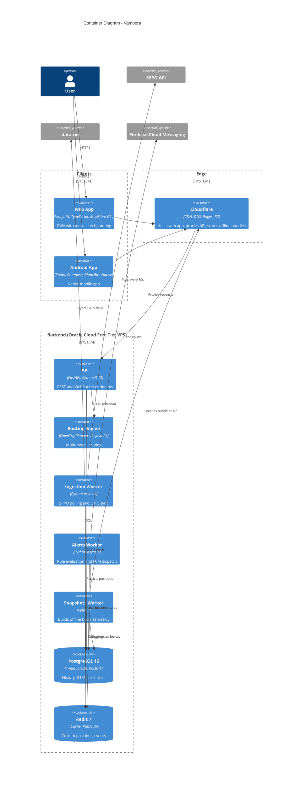

# C4 — Containers

In Phase 0 the API container and the SPPO ingestion worker run together in one process (see `vambora-backend/src/vambora/main.py`). They split into separate processes when the alerts worker arrives. Until then the in-process bus described in [ADR-0001](../adrs/index.md) and [ADR-0004](../adrs/index.md) is sufficient.
