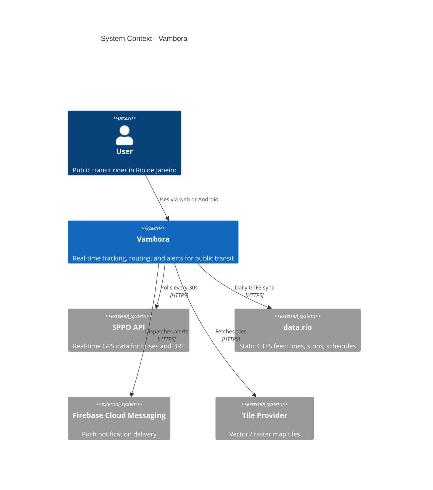

# C4 — System context

The user interacts with Vambora through a Next.js PWA or a native Android app. Both clients share one backend. The backend depends on four external systems: SPPO (live GPS feed), data.rio (static GTFS catalog), FCM (push delivery), and a tile provider (Carto in dev, self-hosted Protomaps in prod).
