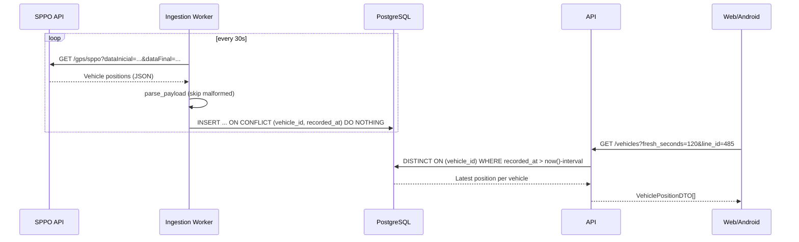

# Real-time ingestion flow

## Why three timestamps

Each row in `vehicle_positions` carries `recorded_at`, `sent_at`, and `received_at`. The distinction matters in production:

- **`recorded_at`** (SPPO `datahora`) — when the GPS fix was taken on the bus. Use for trajectory math and ETA extrapolation.
- **`sent_at`** (SPPO `datahoraenvio`) — when the bus uplinked the fix. The gap from `recorded_at` is upstream queue lag.
- **`received_at`** (SPPO `datahoraservidor`) — when the central server logged it. **Use this column to decide whether a vehicle is "live now."** SPPO's date-range filter operates on this column; a "fresh" 30s window can include GPS fixes that are hours old.

See [SPPO data source](../data-sources/sppo.md) for the full quirk list captured during the 2026-05-09 spike.

## Why dedup on `(vehicle_id, recorded_at)`

The SPPO server re-emits the same record across overlapping fetch windows. ~2 % of fetched records collide with already-persisted rows. The `UNIQUE (vehicle_id, recorded_at)` index plus `ON CONFLICT DO NOTHING` upsert keeps the table clean without per-fetch reconciliation logic.
